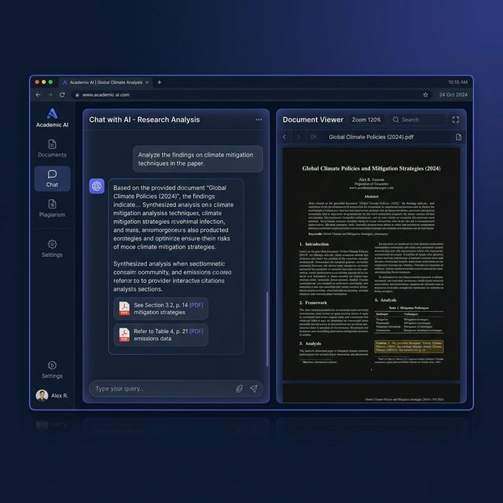
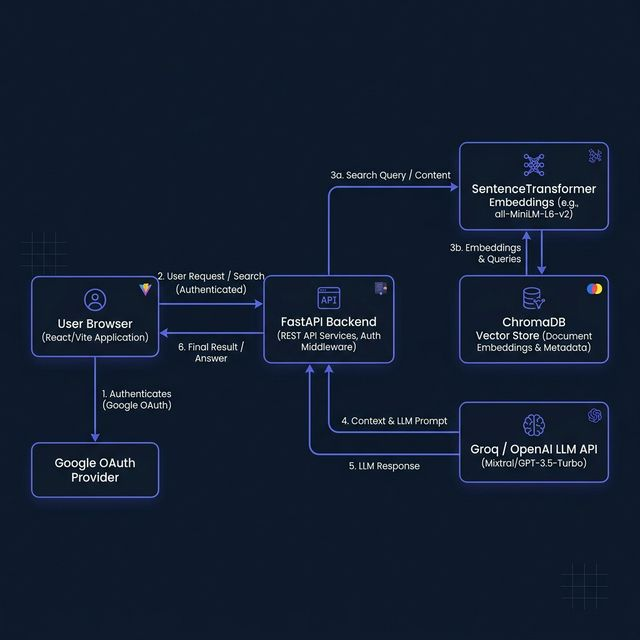

<div align="center">

# 🎓 Academic AI — Enterprise Research Intelligence Platform

[](https://python.org)
[](https://fastapi.tiangolo.com)
[](https://react.dev)
[](https://vitejs.dev)
[](https://www.trychroma.com)
[](LICENSE)

**A state-of-the-art, full-stack AI platform that transforms how researchers, academics, and enterprise teams interact with documents.** Upload research papers, query them with natural language, detect plagiarism, check grammar, and summarize complex texts — all in one secure, unified hub.

[**🚀 Live Demo**](#deployment) · [**📖 API Docs**](#api-reference) · [**🐛 Report Bug**](https://github.com/Soumyadip004/Academic-Ai/issues) · [**💡 Request Feature**](https://github.com/Soumyadip004/Academic-Ai/issues)

---



</div>

---

## 📋 Table of Contents

- [✨ Features](#-features)
- [🏗️ Architecture](#️-architecture)
- [📁 Project Structure](#-project-structure)
- [⚙️ Tech Stack](#️-tech-stack)
- [🚀 Quick Start](#-quick-start)
- [🔧 Environment Variables](#-environment-variables)
- [📡 API Reference](#-api-reference)
- [🎨 Frontend Pages](#-frontend-pages)
- [🔐 Authentication](#-authentication)
- [☁️ Deployment](#️-deployment)
- [🤝 Contributing](#-contributing)
- [📬 Contact](#-contact)
- [📄 License](#-license)

---

## ✨ Features

### 🧠 Core Intelligence
| Feature | Description |
|---|---|
| **📄 Document Vault** | Upload PDFs, DOCX, and TXT files. Automatic text extraction, chunking, and vector embedding generation. |
| **💬 Knowledge Chat (RAG)** | Ask questions against your uploaded corpus. Retrieves the most relevant chunks and generates cited, context-aware answers. |
| **🤖 General AI Chat** | Conversational AI assistant powered by Groq (Llama 3.3 70B) or OpenAI (GPT-4o) for open-ended research queries. |
| **🔍 Similarity Engine** | Professional-grade plagiarism detection. Compares text against all indexed documents with per-sentence similarity scores. |
| **✅ Grammar & Spell Check** | Advanced grammar and spelling analysis powered by LanguageTool, specifically calibrated for academic writing. |
| **📝 Text Summarizer** | Condense lengthy papers into bullet points, abstracts, or detailed summaries with adjustable verbosity. |

### 🔒 Enterprise & Security
| Feature | Description |
|---|---|
| **🔑 Google OAuth 2.0** | Secure, real Google Sign-In authentication with backend token validation. |
| **👤 User Data Isolation** | All documents and vectors are scoped per-user. No data leakage between accounts. |
| **🏠 Local Embeddings** | Embedding model (`all-MiniLM-L6-v2`) runs **entirely locally**, ensuring sensitive research data never leaves your server. |
| **🌙 Dark/Light Theme** | Fully themed UI with persistent preference storage. |

### 🎨 Premium UI/UX
| Feature | Description |
|---|---|
| **📊 Analytics Dashboard** | Real-time credit usage tracking and document statistics. |
| **📑 PDF Workspace** | Inline PDF viewer with side-by-side AI chat for document-specific Q&A. |
| **🧭 Interactive API Docs** | Built-in developer portal with multi-language code tabs (cURL, Python, Node.js). |
| **✨ Modern Design** | Glassmorphism, gradient accents, micro-animations, and responsive layouts. |

---

## 🏗️ Architecture

```
┌─────────────────────────────────────────────────────────────────┐
│                        CLIENT (Browser)                         │
│  ┌───────────┐  ┌──────────┐  ┌──────────┐  ┌───────────────┐  │
│  │  React 18 │  │  Vite 5  │  │  Router  │  │ Google OAuth  │  │
│  └─────┬─────┘  └────┬─────┘  └────┬─────┘  └───────┬───────┘  │
│        └──────────────┴─────────────┴────────────────┘          │
│                           REST API                              │
├─────────────────────────────────────────────────────────────────┤
│                      SERVER (FastAPI)                            │
│  ┌────────────┐  ┌──────────────┐  ┌──────────────────────────┐ │
│  │   Routes   │  │   Services   │  │      Vector Store        │ │
│  │ ─ auth     │  │ ─ chat       │  │ ┌──────────────────────┐ │ │
│  │ ─ docs     │  │ ─ rag        │  │ │    ChromaDB          │ │ │
│  │ ─ rag      │  │ ─ plagiarism │  │ │  (Persistent Store)  │ │ │
│  │ ─ chat     │  │ ─ spellcheck │  │ └──────────────────────┘ │ │
│  │ ─ plag     │  │ ─ documents  │  │ ┌──────────────────────┐ │ │
│  │ ─ spell    │  │ ─ vector     │  │ │ SentenceTransformers │ │ │
│  └────────────┘  └──────────────┘  │ │  all-MiniLM-L6-v2   │ │ │
│                                     │ └──────────────────────┘ │ │
│                                     └──────────────────────────┘ │
├─────────────────────────────────────────────────────────────────┤
│                     EXTERNAL SERVICES                           │
│  ┌──────────┐  ┌──────────────┐  ┌────────────────────────────┐ │
│  │  Groq AI │  │   OpenAI     │  │   LanguageTool Server     │ │
│  │ Llama 3  │  │   GPT-4o     │  │   (Grammar & Spelling)    │ │
│  └──────────┘  └──────────────┘  └────────────────────────────┘ │
└─────────────────────────────────────────────────────────────────┘
```



---

## 📁 Project Structure

```
Academic-AI/
├── 📄 .env                        # Environment variables (secrets)
├── 📄 .env.example                # Template for environment setup
├── 📄 .gitignore                  # Git ignore rules
├── 📄 requirements.txt            # Python dependencies
├── 📄 runtime.txt                 # Python version for Render
├── 📄 README.md                   # ← You are here
│
├── 🗂️ backend/                    # FastAPI Backend Application
│   ├── 📄 __init__.py
│   ├── 📄 main.py                 # App entry point, CORS, static files
│   ├── 📄 config.py               # Pydantic settings & environment config
│   │
│   ├── 🗂️ api/
│   │   ├── 📄 __init__.py
│   │   └── 🗂️ routes/
│   │       ├── 📄 __init__.py     # Router aggregation
│   │       ├── 📄 auth.py         # Google OAuth token verification
│   │       ├── 📄 documents.py    # Upload, list, delete documents
│   │       ├── 📄 rag.py          # Knowledge chat (RAG) endpoint
│   │       ├── 📄 chat.py         # General AI chat endpoint
│   │       ├── 📄 plagiarism.py   # Similarity engine endpoint
│   │       └── 📄 spellcheck.py   # Grammar & spell check endpoint
│   │
│   ├── 🗂️ models/
│   │   ├── 📄 __init__.py
│   │   └── 📄 schemas.py          # Pydantic request/response models
│   │
│   ├── 🗂️ services/
│   │   ├── 📄 __init__.py
│   │   ├── 📄 vector_store.py     # ChromaDB + SentenceTransformers
│   │   ├── 📄 rag_service.py      # RAG pipeline (retrieve + generate)
│   │   ├── 📄 chat_service.py     # LLM chat (Groq/OpenAI/Ollama)
│   │   ├── 📄 document_service.py # File I/O, text extraction
│   │   ├── 📄 plagiarism_service.py # Overlap detection logic
│   │   └── 📄 spellcheck_service.py # LanguageTool integration
│   │
│   └── 🗂️ prompts/
│       └── 📄 spellcheck_prompt.txt # System prompt for grammar AI
│
├── 🗂️ frontend/                   # React + Vite Frontend
│   ├── 📄 .env                    # Frontend environment (API URL, OAuth)
│   ├── 📄 index.html              # HTML entry point
│   ├── 📄 package.json            # Node.js dependencies
│   ├── 📄 vite.config.js          # Vite configuration
│   │
│   ├── 🗂️ public/
│   │   └── 📄 logo.png            # Brand logo asset
│   │
│   └── 🗂️ src/
│       ├── 📄 main.jsx            # React DOM entry
│       ├── 📄 App.jsx             # Route definitions
│       ├── 📄 api.js              # Axios API client
│       ├── 📄 index.css           # Complete design system (50KB+)
│       │
│       ├── 🗂️ context/
│       │   ├── 📄 AuthContext.jsx  # Google OAuth state management
│       │   └── 📄 ThemeContext.jsx # Dark/Light theme provider
│       │
│       ├── 🗂️ layouts/
│       │   ├── 📄 PublicLayout.jsx    # Marketing site layout (nav + footer)
│       │   └── 📄 DashboardLayout.jsx # Authenticated app layout (sidebar)
│       │
│       └── 🗂️ pages/
│           ├── 📄 Home.jsx            # Landing page
│           ├── 📄 About.jsx           # Company & services overview
│           ├── 📄 Pricing.jsx         # Subscription tiers
│           ├── 📄 Faq.jsx             # Frequently asked questions
│           ├── 📄 Support.jsx         # Contact & ticket system
│           ├── 📄 Login.jsx           # Google OAuth sign-in
│           ├── 📄 DocumentUpload.jsx  # File upload & document vault
│           ├── 📄 DocumentDetail.jsx  # PDF viewer + doc-specific chat
│           ├── 📄 RagChat.jsx         # Knowledge chat interface
│           ├── 📄 AiChat.jsx          # General AI assistant
│           ├── 📄 PlagiarismChecker.jsx # Similarity detection UI
│           ├── 📄 SpellChecker.jsx    # Grammar & spell check UI
│           ├── 📄 Summarizer.jsx      # Text summarization tool
│           ├── 📄 Documentation.jsx   # Interactive API developer hub
│           └── 📄 Settings.jsx        # User preferences & analytics
│
├── 🗂️ uploads/                    # Stored uploaded documents (gitignored)
├── 🗂️ vector_store/              # ChromaDB persistent storage (gitignored)
└── 🗂️ docs/
    └── 🗂️ screenshots/           # README images
```

---

## ⚙️ Tech Stack

### Backend
| Technology | Purpose |
|---|---|
| [**FastAPI**](https://fastapi.tiangolo.com) | High-performance async web framework |
| [**ChromaDB**](https://www.trychroma.com) | Vector database for semantic search |
| [**SentenceTransformers**](https://www.sbert.net) | Local embedding model (`all-MiniLM-L6-v2`) |
| [**Groq**](https://groq.com) | Ultra-fast LLM inference (Llama 3.3 70B) |
| [**OpenAI**](https://openai.com) | GPT-4o integration (optional) |
| [**LanguageTool**](https://languagetool.org) | Grammar & spell checking engine |
| [**PyPDF2**](https://pypdf2.readthedocs.io) | PDF text extraction |
| [**python-docx**](https://python-docx.readthedocs.io) | DOCX text extraction |

### Frontend
| Technology | Purpose |
|---|---|
| [**React 18**](https://react.dev) | Component-based UI framework |
| [**Vite 5**](https://vitejs.dev) | Lightning-fast build tool |
| [**React Router v6**](https://reactrouter.com) | Client-side routing |
| [**Lucide React**](https://lucide.dev) | Beautiful icon library |
| [**Google Identity Services**](https://developers.google.com/identity) | OAuth 2.0 authentication |

### Infrastructure
| Technology | Purpose |
|---|---|
| [**Render**](https://render.com) | Cloud hosting (backend) |
| [**Vercel / Netlify**](https://vercel.com) | Static frontend hosting |
| [**Git + GitHub**](https://github.com) | Version control |

---

## 🚀 Quick Start

### Prerequisites

- **Python** 3.11+
- **Node.js** 18+
- **npm** 9+
- A [**Groq API Key**](https://console.groq.com) (free tier available)
- A [**Google OAuth Client ID**](https://console.cloud.google.com) for authentication

### 1. Clone the Repository

```bash
git clone https://github.com/Soumyadip004/Academic-Ai.git
cd Academic-Ai
```

### 2. Backend Setup

```bash
# Create and activate a virtual environment
python -m venv venv

# Windows
venv\Scripts\activate

# macOS/Linux
source venv/bin/activate

# Install dependencies
pip install -r requirements.txt

# Install the local embedding model
pip install sentence-transformers
```

### 3. Configure Environment

```bash
# Copy the example environment file
cp .env.example .env

# Edit .env with your actual API keys
```

> ⚠️ **Important:** You must set `GROQ_API_KEY` and `VITE_GOOGLE_CLIENT_ID` at minimum.

### 4. Start the Backend

```bash
python -m uvicorn backend.main:app --reload --host 0.0.0.0 --port 8000
```

The API will be live at `http://localhost:8000`. Visit `http://localhost:8000/docs` for the auto-generated Swagger UI.

### 5. Frontend Setup

```bash
# Open a new terminal
cd frontend

# Install dependencies
npm install

# Start the dev server
npm run dev
```

The frontend will be live at `http://localhost:5173`.

---

## 🔧 Environment Variables

Create a `.env` file in the project root:

```env
# ── LLM Provider ──────────────────────────────
LLM_PROVIDER=groq                    # Options: groq, openai, ollama

# ── API Keys ──────────────────────────────────
GROQ_API_KEY=gsk_your_key_here       # Get from console.groq.com
OPENAI_API_KEY=sk-your_key_here      # Get from platform.openai.com

# ── Google OAuth ──────────────────────────────
VITE_GOOGLE_CLIENT_ID=your_client_id # Get from Google Cloud Console

# ── Model Configuration ──────────────────────
GROQ_MODEL=llama-3.3-70b-versatile
OPENAI_MODEL=gpt-4o-mini
OLLAMA_MODEL=llama3.2
OLLAMA_BASE_URL=http://localhost:11434

# ── Embedding (runs locally) ─────────────────
EMBEDDING_MODEL=all-MiniLM-L6-v2     # ~80MB, ideal for deployment

# ── RAG Settings ─────────────────────────────
CHUNK_SIZE=500                        # Characters per text chunk
CHUNK_OVERLAP=50                      # Overlap between chunks
TOP_K_RESULTS=5                       # Chunks returned per query
```

Create a `frontend/.env` file:

```env
VITE_API_URL=http://localhost:8000
VITE_GOOGLE_CLIENT_ID=your_client_id
```

---

## 📡 API Reference

All endpoints use REST conventions and return JSON. Include `X-User-Id` header for authentication.

### Documents

| Method | Endpoint | Description |
|---|---|---|
| `POST` | `/api/documents/upload` | Upload a PDF, DOCX, or TXT file |
| `GET` | `/api/documents/` | List all user documents |
| `DELETE` | `/api/documents/{doc_id}` | Delete a document and its vectors |

### Chat & RAG

| Method | Endpoint | Description |
|---|---|---|
| `POST` | `/api/rag/chat` | Query knowledge base with RAG |
| `POST` | `/api/chat` | General AI conversation |

### Academic Tools

| Method | Endpoint | Description |
|---|---|---|
| `POST` | `/api/plagiarism/check` | Check text similarity against corpus |
| `POST` | `/api/spellcheck/check` | Grammar and spell check |

### Authentication

| Method | Endpoint | Description |
|---|---|---|
| `POST` | `/api/auth/google` | Verify Google OAuth token |

### Example Request

```bash
# Upload a document
curl -X POST "http://localhost:8000/api/documents/upload" \
  -H "X-User-Id: user@example.com" \
  -F "file=@research_paper.pdf"

# Ask a question about your documents
curl -X POST "http://localhost:8000/api/rag/chat" \
  -H "Content-Type: application/json" \
  -H "X-User-Id: user@example.com" \
  -d '{"question": "What are the key findings?", "top_k": 5}'
```

### Example Response

```json
{
  "answer": "The key findings include: 1) Significant improvement in...",
  "sources": [
    {
      "filename": "research_paper.pdf",
      "text": "Our experiments demonstrate a 23% improvement...",
      "similarity": 0.92
    }
  ]
}
```

---

## 🎨 Frontend Pages

| Page | Route | Description |
|---|---|---|
| 🏠 Home | `/` | Landing page with feature showcase |
| 📖 About | `/about` | Company mission, services & differentiators |
| 💰 Pricing | `/pricing` | Subscription tiers & comparison |
| ❓ FAQ | `/faq` | Common questions & answers |
| 🆘 Support | `/support` | Contact, email, and ticket system |
| 🔐 Login | `/login` | Google OAuth sign-in |
| 📂 Document Vault | `/dashboard/documents` | Upload & manage files |
| 📋 Document Detail | `/dashboard/documents/:id` | PDF viewer + Q&A chat |
| 💬 Knowledge Chat | `/dashboard/rag-chat` | RAG-powered Q&A |
| 🤖 AI Assistant | `/dashboard/ai-chat` | General AI conversation |
| 🔍 Plagiarism Check | `/dashboard/plagiarism` | Similarity detection |
| ✅ Grammar Check | `/dashboard/spell-check` | Spell & grammar analysis |
| 📝 Summarizer | `/dashboard/summarize` | Text summarization |
| 📡 API Docs | `/dashboard/docs` | Interactive developer portal |
| ⚙️ Settings | `/dashboard/settings` | Preferences & analytics |

---

## 🔐 Authentication

Academic AI uses **Google OAuth 2.0** for secure authentication:

1. User clicks "Sign in with Google" on the login page.
2. Google returns a JWT `credential` token.
3. Frontend sends the token to `/api/auth/google` for backend verification.
4. Backend decodes the token using Google's public keys and extracts user info.
5. User session is stored in React context with `localStorage` persistence.

```
┌──────────┐     ┌──────────┐     ┌──────────┐
│  Browser │────▶│  Google  │────▶│  FastAPI  │
│          │◀────│  OAuth   │     │  Backend  │
│  React   │     └──────────┘     │          │
│  Context │◀─────────────────────│ Verified │
└──────────┘                      └──────────┘
```

---

## ☁️ Deployment

### Render (Backend)

1. Push your code to GitHub.
2. Create a new **Web Service** on [Render](https://render.com).
3. Set the following:
   - **Build Command:** `pip install -r requirements.txt`
   - **Start Command:** `uvicorn backend.main:app --host 0.0.0.0 --port $PORT`
   - **Runtime:** Python 3.11 (specified in `runtime.txt`)
4. Add all environment variables from `.env` to Render's dashboard.

> 💡 **Tip:** The `all-MiniLM-L6-v2` model (~80MB) is optimized for Render's 512MB RAM limit.

### Vercel / Netlify (Frontend)

1. Navigate to the `frontend/` directory.
2. Run `npm run build` to generate the production bundle.
3. Deploy the `dist/` folder to Vercel or Netlify.
4. Set the `VITE_API_URL` environment variable to your Render backend URL.

---

## 🧪 How It Works — RAG Pipeline

```
┌──────────────────────────────────────────────────────────────┐
│                    DOCUMENT INGESTION                         │
│                                                              │
│  PDF/DOCX/TXT ──▶ Text Extraction ──▶ Chunking (500 chars)  │
│                                           │                  │
│                                    SentenceTransformers      │
│                                    (all-MiniLM-L6-v2)        │
│                                           │                  │
│                                     384-dim Vectors          │
│                                           │                  │
│                                      ChromaDB Store          │
└──────────────────────────────────────────────────────────────┘

┌──────────────────────────────────────────────────────────────┐
│                    QUERY PIPELINE                             │
│                                                              │
│  User Question ──▶ Embed Query ──▶ Cosine Similarity Search  │
│                                           │                  │
│                                     Top-K Chunks             │
│                                           │                  │
│                              ┌────────────┴────────────┐     │
│                              │    System Prompt +       │     │
│                              │    Retrieved Context +   │     │
│                              │    User Question         │     │
│                              └────────────┬────────────┘     │
│                                           │                  │
│                                     LLM (Groq/OpenAI)        │
│                                           │                  │
│                                   Cited Answer + Sources     │
└──────────────────────────────────────────────────────────────┘
```

---

## 🤝 Contributing

Contributions are welcome! Here's how to get started:

1. **Fork** the repository
2. **Create** a feature branch: `git checkout -b feature/amazing-feature`
3. **Commit** your changes: `git commit -m 'Add amazing feature'`
4. **Push** to the branch: `git push origin feature/amazing-feature`
5. **Open** a Pull Request

### Development Guidelines

- Follow PEP 8 for Python code
- Use functional React components with hooks
- Write descriptive commit messages
- Test all API endpoints before submitting PRs

---

## 📬 Contact

**Soumyadip Chanda** — Creator & Lead Developer

[](https://www.linkedin.com/in/soumyadip-c-251026229/)
[](mailto:soumyadipchanda.work@gmail.com)
[](https://github.com/Soumyadip004)

---

## 📄 License

This project is licensed under the **MIT License** — see the [LICENSE](LICENSE) file for details.

---

<div align="center">

### ⭐ Star this repo if you find it helpful!

**Built with ❤️ by [Soumyadip Chanda](https://www.linkedin.com/in/soumyadip-c-251026229/)**

</div>
